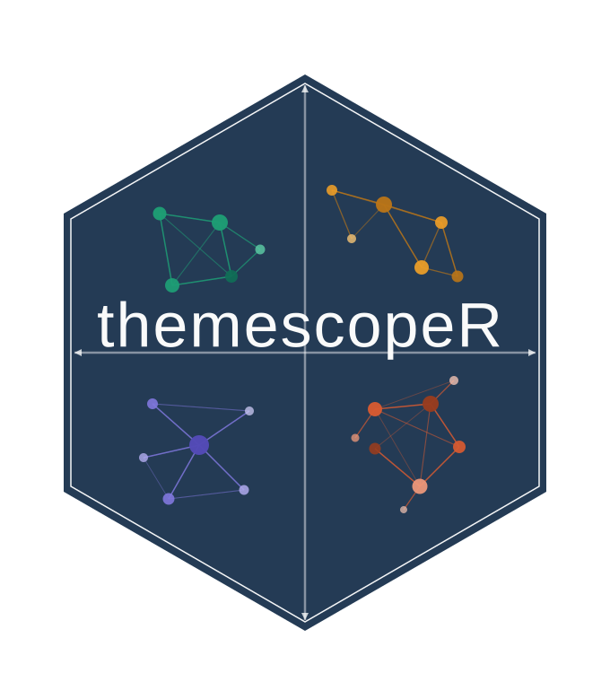

<!-- README.md is written by hand; edit here directly. -->



# themescopeR

**Social Representation Analysis via Semantic Network Mapping**

`themescopeR` implements the **ThemeScope** framework for detecting and
visualising *social representations* in large-scale digital text corpora. From
raw documents it builds sentence-level word **co-occurrence networks**, detects
thematic **communities**, and locates them on a two-dimensional **strategic
diagram** using two indicators grounded in Social Representation Theory (SRT):

- **PSI**, the *Prototypical Salience Index* (anchoring): how structurally
  embedded a theme is in the wider discourse.
- **CS**, the *Concreteness Score* (objectification): how far a theme is
  articulated through concrete, imageable vocabulary.

The whole analysis runs from the **R console**; an optional **Shiny** GUI offers
the same pipeline point-and-click and is backed by the very same exported
functions.

---

## Citation

Using `themescopeR` or the ThemeScope method requires citing the paper that
introduces it. Publishing results without attribution violates the terms of use.

> Misuraca, M., Spano, M., and D'Aniello, L. (2026). ThemeScope: A quantitative
> thematic analysis for depicting social representations in digital arenas.
> *Journal of Information Science*.
> [doi:10.1177/01655515261454276](https://doi.org/10.1177/01655515261454276)

```bibtex
@article{misuraca2026themescope,
  author  = {Misuraca, Michelangelo and Spano, Maria and D'Aniello, Luca},
  title   = {ThemeScope: A quantitative thematic analysis for depicting social representations in digital arenas},
  journal = {Journal of Information Science},
  year    = {2026},
  doi     = {10.1177/01655515261454276},
  url     = {https://doi.org/10.1177/01655515261454276}
}
```

In R, `citation("themescopeR")` prints the same reference.

---

## Installation

```r
# install.packages("remotes")
remotes::install_github("lucadaniello/themescopeR")
```

The optional GUI additionally needs: `shiny`, `bslib`, `DT`, `plotly`,
`visNetwork`, `shinycssloaders`. `writexl` enables the Excel exports.

---

## Quick start (console)

```r
library(themescopeR)

# 1. Read a collection of raw documents (csv / tsv / txt / xlsx / RData / zip)
coll <- read_collection(
  system.file("extdata", "sample_collection.csv", package = "themescopeR"),
  sequential_ids = TRUE          # documents numbered doc_1, doc_2, ...
)

# 2. Annotate with udpipe (the language model is downloaded once and cached)
tokens <- preprocess_texts(coll, model = "english")

# 3. Run the full ThemeScope pipeline
result <- themescope(tokens, vocab_size = 1500, seed = 1)

# 4. Inspect and visualise
print(result)
as.data.frame(result)      # community-level table: PSI, CS, z-scores, quadrant
plot(result, type = "map") # the ThemeScope strategic diagram (ggplot2)
plot(result, type = "network")
top_terms(result, n = 10)  # most representative terms per community

# 5. Save the whole study in one file, and reopen it later
save_themescope(result, "climate_study.themescope", words = tokens, collection = coll)
archive <- read_themescope("climate_study.themescope")
summary(archive)
```

`themescope()` can also start **directly from raw texts**, annotating
internally:

```r
result <- themescope(coll, model = "english", vocab_size = 1500, seed = 1)
```

To skip the annotation step entirely while trying the package out, the bundled
demo corpus ships already tokenised, lemmatised and POS tagged (English GUM
treebank):

```r
tokens <- readRDS(system.file("extdata", "demo_annotated.rds", package = "themescopeR"))
result <- themescope(tokens, seed = 1)
```

### Language models (downloaded once, cached)

Preprocessing uses the updated Universal Dependencies 2.15 `udpipe` models
maintained for [TALL](https://github.com/massimoaria/tall.language.models).

```r
ts_list_models()              # available languages / treebanks
ts_download_model("italian")  # download + cache (no-op if already cached)
themescope_cache_dir()        # where models are stored
```

The cache lives in `tools::R_user_dir("themescopeR", "cache")`; override it with
`options(themescopeR.model_dir = "/your/path")`.

---

## Shiny GUI

```r
themescope_app()
```

The interface follows the pipeline step by step, and every step calls the
exported functions, so the GUI and the console give identical results.

1. **Import.** Choose the data type first: raw text (a single file or a zip of
   many), a saved `.themescope` archive, or the bundled demo corpus. Tabular
   files let you pick which column holds the text. Documents are numbered
   `doc_1`, `doc_2`, ... with the original identifier kept as `source_id`. A
   file bigger than the current upload limit opens a window offering to raise
   it, then imports automatically.
2. **Preprocess.** Pick the annotation language and the exact treebank; the best
   model for the language is preselected, with its description underneath. The
   demo corpus and archives arrive annotated, so this step is skipped.
3. **Run.** Set the vocabulary, POS filter, co-occurrence window, similarity
   measure, edge threshold, community algorithm and concreteness lexicon, then
   run the analysis.
4. **Refine.** *Network appearance* in the sidebar controls repulsion between
   communities, node spacing inside a community (measured in node diameters),
   edge opacity, label size, node size, the layout seed, term labels and whether
   unclassified terms are drawn. **Refine network** redraws the graph without
   recomputing the analysis.

The results are shown as an interactive **map** and **network** (ThemeScope
tab), a filterable **community table**, and **top terms** as both charts and
collapsible per-cluster lists. The **Reproduce** tab prints the console code
equivalent to what the GUI just did, and **Export .themescope** saves the
annotated corpus, the parameters and the term scores in a single file.

---

## Main functions

The package mirrors the ThemeScope pipeline as a chain of small, pure,
command-line functions. `themescope()` runs them all in order, but each stage is
exported so you can inspect or customise any step. They are presented below in
the order the pipeline calls them.

### 1. Import: `read_collection()`

```r
read_collection(path, text_col = NULL, id_col = NULL, sequential_ids = FALSE)
```

Reads a document collection into a tidy data frame with a `doc_id` and a `text`
column. It auto-detects the format from the file extension and supports a
**single** `.csv`/`.tsv`, `.txt`, `.xlsx`/`.xls`, `.RData`/`.rda`, **or** a
`.zip` containing many such files (unzipped to a temporary directory, read, and
row-bound). Text and id columns are guessed but can be forced with `text_col` /
`id_col`. With `sequential_ids = TRUE` documents are numbered `doc_1`, `doc_2`,
... and the identifier that came with the file is kept as `source_id`, which is
handy when the source ids are long hashes. Malformed input raises a clear,
actionable error.

### 2. Linguistic annotation: `preprocess_texts()`

```r
preprocess_texts(collection, model = "english", text_col = "text",
                 doc_id_col = "doc_id", verbose = TRUE)
```

Annotates the raw texts with [`udpipe`](https://CRAN.R-project.org/package=udpipe):
tokenisation, lemmatisation, sentence segmentation and part-of-speech (UPOS)
tagging. `model` accepts a language name, a `.udpipe` file path, or a loaded
model object; language models come from the updated Universal Dependencies 2.15
treebanks and are downloaded once and cached (see
`ts_list_models()`, `ts_download_model()`, `ts_model_path()`,
`themescope_cache_dir()`). It returns the **full** udpipe annotation
(one row per token, with `doc_id`, `sentence_id`, `token`, `lemma`, `upos` and
the rest), which is the input every downstream function expects.

### 3. Vocabulary: `build_vocab()`

```r
build_vocab(words_df, unit = "lemma", vocab_size = 1500,
            pos_filter = c("NOUN", "ADJ", "PROPN"))
```

Filters the annotation to content words (by default nouns, adjectives and proper
nouns), counts them on the chosen `unit` (`"lemma"` or `"token"`), and keeps the
`vocab_size` most frequent terms. Returns a data frame of `term`, `freq` and
`upos`, the node set of the network.

### 4. Co-occurrence and association strength: `build_cooccurrence_matrix()`

```r
build_cooccurrence_matrix(words_df, vocab, unit = "lemma",
                          window = "sentence", normalization = "association")
```

Counts how often each pair of vocabulary terms appears together within the same
`window` (`"sentence"` or `"document"`) and rescales the raw co-occurrence counts
into a similarity matrix via `normalization`. The default `"association"`
(Association Strength, `AS(t,t') = a_tt' / (a_t * a_t')`) is the measure used in
the paper; `"jaccard"`, `"salton"`, `"inclusion"`, `"equivalence"` and
`"frequency"` are also available (`normalize_cooccurrence()`,
`compute_association_strength()` expose them individually). It returns both the
normalised matrix and each term's **presence** `a_t` (sentence/document count),
which PSI needs later.

### 5. Network construction: `build_cooccurrence_network()`

```r
build_cooccurrence_network(as_matrix, threshold_percentile = 0.98)
```

Turns the similarity matrix into a weighted, undirected `igraph` network, keeping
only the strongest edges (those above the `threshold_percentile`) and dropping
isolated nodes. This sparse backbone is what gets partitioned into themes.

### 6. Community detection: `detect_communities()`

```r
detect_communities(graph, algorithm = "walktrap", min_size = 10, seed = NULL)
```

Partitions the network into thematic **communities** (candidate social
representations) with `"walktrap"` (default), `"louvain"` or `"leiden"`.
Communities smaller than `min_size` are dropped; pass a `seed` for reproducible
results. `get_community_subgraphs()` splits the graph into one subgraph per
community.

### 7. The two SRT indicators: `compute_psi()` and `compute_cs()`

```r
compute_psi(graph, communities, presence)
compute_cs(graph, communities, concreteness_lexicon = brysbaert)
```

- **`compute_psi()`**, the **Prototypical Salience Index** (anchoring): how
  structurally salient and frequent a community's terms are within the wider
  discourse, normalised by community density.
- **`compute_cs()`**, the **Concreteness Score** (objectification): the
  association-weighted mean concreteness of a community's terms, using the
  bundled `brysbaert` lexicon (`lexicon_coverage()` / `match_concreteness()`
  report and apply the matching).

Both return one value per community; `themescope()` z-scores them and places each
community in a quadrant (`assign_quadrant()`, `zscore()`).

### 8. Representative terms: `term_relevance()` and `top_terms()`

```r
term_relevance(graph, membership, presence)
top_terms(x, n = 10, by = "relevance")   # or by = "frequency" / "degree"
```

Rank the terms inside each community so each theme can be labelled by its most
characteristic words. `term_relevance()` implements the case-study relevance
measure

$$R_t(g_i) = \log(1 + a_t)\cdot\frac{s_t^{\text{in}}(g_i)}{s_t^{\text{in}}(g_i) + s_t^{\text{out}}(g_i)},$$

where `a_t` is the term presence, and `s_t^in` / `s_t^out` are the total
association strength linking `t` to terms inside / outside its own community.
`top_terms()` ranks by `"relevance"` (the default `R_t`, which downweights
generic terms shared across clusters), by `"frequency"` (term presence `a_t`
alone), or by `"degree"`. Relevance is the labelling method used throughout
ThemeScope; frequency is kept as a simpler alternative.

### 9. Visualisation: `plot_themescope()` and `plot_network()`

```r
plot_themescope(psi, cs, ...)   # the strategic diagram (ggplot2)
plot_network(graph, ...)        # the coloured co-occurrence network
```

`plot_themescope()` draws the z-scored **PSI by CS strategic diagram** with the
four labelled quadrants; `plot_network()` draws the community-coloured network.
Both share `themescope_colours()`, so a community keeps the same colour on the
map and on the network. On a `themescope` object simply call
`plot(result, type = "map" | "network")`; `plot(result, label = "terms")` labels
each community with its top terms (ranked by relevance by default; pass
`label_by = "frequency"` to label by term frequency instead).

### 10. Saving a study: `save_themescope()` and `read_themescope()`

```r
save_themescope(result, "study.themescope", words = tokens, collection = coll,
                meta = list(language = "english", lexicon = "Brysbaert"))
archive <- read_themescope("study.themescope")
summary(archive)          # corpus, parameters, vocabulary, network, lexicon
plot(archive$result, type = "map", label = "terms")
```

A `.themescope` file is a compressed archive holding the `themescope` object,
the annotated corpus it was computed from, the raw texts, the term-level table
with the scores behind the maps, the community table and the parameters of the
run. Reopening it restores maps, communities and top terms with nothing
recomputed, in the console or in the GUI.

### 11. Orchestrator and GUI: `themescope()` and `themescope_app()`

`themescope()` runs stages 3 to 9 (and stages 1 to 2 if you hand it a raw
collection plus a `model`) and returns a structured `themescope` object with
`print()`, `summary()`, `plot()` and `as.data.frame()` methods.
`themescope_app()` launches the Shiny GUI, which calls these same exported
functions.

### Summary table

| Function | Purpose |
|---|---|
| `read_collection()` | Import raw documents (single file or zip of many) into a tidy data frame |
| `preprocess_texts()` | udpipe annotation; returns the **full** udpipe data frame |
| `ts_download_model()`, `ts_list_models()`, `ts_model_path()` | Manage cached language models |
| `build_vocab()` | Vocabulary as a data frame (`term`, `freq`, `upos`) |
| `build_cooccurrence_matrix()` | Sentence/document co-occurrence + chosen `normalization` |
| `normalize_cooccurrence()`, `compute_association_strength()` | Similarity measures (association, jaccard, salton, inclusion, equivalence) |
| `build_cooccurrence_network()` | Thresholded weighted network |
| `detect_communities()`, `get_community_subgraphs()` | Walktrap / Louvain / Leiden community detection |
| `compute_psi()`, `compute_cs()` | The two SRT indicators |
| `term_relevance()`, `top_terms()` | Representative terms per community |
| `plot_themescope()`, `plot_network()`, `themescope_colours()` | Map, igraph network, shared palette |
| `themescope()` | End-to-end pipeline (words **or** raw text) into a `themescope` object |
| `save_themescope()`, `read_themescope()` | Write and reopen a `.themescope` archive |
| `themescope_app()` | Launch the Shiny GUI |

Key options of `themescope()` / `build_cooccurrence_matrix()`: `unit`
(`"lemma"`/`"token"`), `window` (`"sentence"`/`"document"`), `normalization`
(`"association"`, `"jaccard"`, `"salton"`, `"inclusion"`, `"equivalence"`,
`"frequency"`), and `community_algorithm` (`"walktrap"`, `"louvain"`,
`"leiden"`).

---

## Methodology

For communities in the Association-Strength network
(`AS(t,t') = a_tt' / (a_t * a_t')`, with `a_t` the sentence presence of term
`t`):

| Indicator | Definition | SRT construct |
|---|---|---|
| **PSI** | `Psi(g_i) = ( sum_{t in g_i} a_t * s_t ) / max_j delta(g_j)` | Anchoring |
| **CS** | `Cw(g_i) = ( sum_{(t,t') in E_i} ((c(t)+c(t'))/2) * AS(t,t') ) / ( sum AS(t,t') )` | Objectification |

where `s_t` is the mean Association Strength of `t`'s in-community neighbours,
`delta(g_i) = 2 W_i / (|V_i|(|V_i|-1))` the weighted community density, and
`c(.)` the Brysbaert concreteness rating. Communities are placed on the
z-scored PSI by CS plane:

|  | **High CS** | **Low CS** |
|---|---|---|
| **High PSI** | Stable Core | Ideological Core |
| **Low PSI** | Emerging Practices | Latent Representations |

---

## Data and lexicon

- **Bundled lexicon** `brysbaert`: 39,954 English concreteness norms
  (Brysbaert, Warriner and Kuperman, 2014, *Behavior Research Methods*,
  [doi:10.3758/s13428-013-0403-5](https://doi.org/10.3758/s13428-013-0403-5)).
- **Example data** `inst/extdata/sample_collection.csv`: a 1000-document random
  sample of the publicly available
  [Public Opinion on Climate Change](https://www.kaggle.com/datasets/asaniczka/public-opinion-on-climate-change-updated-daily)
  Reddit dataset on Kaggle, plus `inst/extdata/demo_annotated.rds`, the same
  1000 documents already annotated with udpipe.

## Authors

Michelangelo Misuraca, Maria Spano, Luca D'Aniello (maintainer).

## License

MIT, 2026. See [LICENSE](LICENSE).
